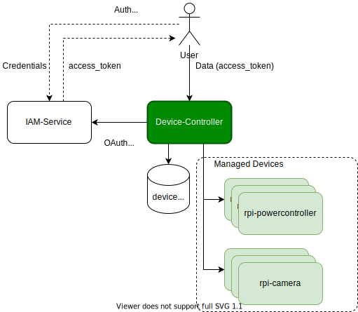

# Device Controller
Raspberry Pi controller gateway.



## Backend microservice(s)
* [__device-controller__](device-controller) - Raspberry Pi controller gateway.
* [__IAM-service__](https://github.com/jveverka/iam-service) - user auth. service.

## Compatible devices
* [__rpi-camera__](../rpi-camera) - RPi Camera project.
* [__rpi-powercontroller__](../rpi-powercontroller) - Remotely controller power switch. 
* [__device-client-sim__](device-client-sim) - Test device simulator.

## Build and Run
```
gradle clean build test
export ARCH=amd64|arm64v8
docker-compose up --build -d
docker logs -f device-controller_device-controller_1
docker-compose down -v --rmi all --remove-orphans
```

## Setup IAM-Service 
1. Get global admin tokens
   ```
   curl --location --request POST 'http://localhost:8080/services/oauth2/iam-admins/iam-admins/token?grant_type=password&username=admin&password=secret&scope=&client_id=admin-client&client_secret=top-secret' \
   --header 'Content-Type: application/x-www-form-urlencoded'
   ```
2. Create device-controller project
   ```
   curl --location --request POST 'http://localhost:8080/services/admin/organization/setup' \
   --header 'Authorization: Bearer <ACCESS_TOKEN>' \
   --header 'Content-Type: application/json' \
   --data-raw '{
        "organizationId": "device-controller",
        "organizationName": "Device Controller",
        "projectId": "device-controller",
        "projectName": "Device Controller",
        "adminClientId": "acl-001",
        "adminClientSecret": "client-secret",
        "adminUserId": "admin",
        "adminUserPassword": "top-secret",
        "adminUserEmail": "admin@project-001.com",
        "projectAudience": [],
        "redirectURL": "http://localhost:80",
        "adminUserProperties": {
        "properties": {}
        }
   }'
   ```
3. Add device-admin permissions and role
   ```
   curl --location --request POST 'http://localhost:8080/services/oauth2/device-controller/device-controller/token?grant_type=password&username=admin&password=top-secret&scope=&client_id=acl-001&client_secret=client-secret' \
   --header 'Content-Type: application/x-www-form-urlencoded'
   
   curl --location --request POST 'http://localhost:8080/services/management/device-controller/device-controller/roles' \
   --header 'Authorization: Bearer <ACCESS_TOKEN>' \
   --header 'Content-Type: application/json' \
   --data-raw '{
        "id": "device-admin",
        "name": "Device Admin",
        "permissions": [
            {
                "service": "device-controller",
                "resource": "devices",
                "action": "read"
            },
            {
                "service": "device-controller",
                "resource": "devices",
                "action": "write"
            },
            {
                "service": "device-controller",
                "resource": "data",
                "action": "read"
            },
            {
                "service": "device-controller",
                "resource": "data",
                "action": "write"
            }
        ]
   }'
   
   curl --location --request PUT 'http://localhost:8080/services/management/device-controller/device-controller/users/admin/roles/device-admin' \
   --header 'Authorization: Bearer <ACCESS_TOKEN>'
   ```
4. Get device admin tokens
   ```
   curl --location --request POST 'http://localhost:8080/services/oauth2/device-controller/device-controller/token?grant_type=password&username=admin&password=top-secret&scope=&client_id=acl-001&client_secret=client-secret' \
   --header 'Content-Type: application/x-www-form-urlencoded'
   ```

## Build Dockers for x86_64 and ARM64 
```
# on x86 AMD64 device:
docker build -t jurajveverka/device-controller:1.1.1-amd64 --build-arg ARCH=amd64 --file ./device-controller/Dockerfile ./device-controller 
docker push jurajveverka/device-controller:1.1.1-amd64

# on ARM64 v8 device:
docker build -t jurajveverka/device-controller:1.1.1-arm64v8 --build-arg ARCH=arm64v8 --file ./device-controller/Dockerfile ./device-controller 
docker push jurajveverka/device-controller:1.1.1-arm64v8

# on x86 AMD64 device: 
docker manifest create \
jurajveverka/device-controller:1.1.1 \
--amend jurajveverka/device-controller:1.1.1-amd64 \
--amend jurajveverka/device-controller:1.1.1-arm64v8

docker manifest push jurajveverka/device-controller:1.1.1
```