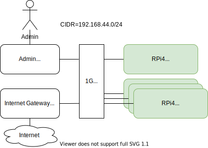

# RPi4 Kubernetes Cluster 
Running dockerized backend services on Arm64 RPi4 hardware.



### 1. Hardware list
| Node Type           | Device                        |
|---------------------|-------------------------------|
| K8s Controller Node | Raspberry Pi 4 (4G or 8G RAM) |
| K8s Worker Nodes    | Raspberry Pi 4 (8G RAM)       |

### 2. Prepare all nodes
* Install [64bit Raspberry Pi OS Lite](https://downloads.raspberrypi.org/raspios_lite_arm64/) for Arm64.
* Update the system
  ```
  sudo apt update
  sudo apt upgrade
  sudo apt install vim docker.io 
  ``` 
* Set hostname, edit files:
  ```
  /etc/hostname
  /etc/hosts
  ```
* Expand file system to full SD capacity and reboot.
  ```
  sudo raspi-config
  ```
* Disable swap
  ```
  sudo dphys-swapfile swapoff
  sudo dphys-swapfile uninstall
  sudo systemctl disable dphys-swapfile
  ```
* Edit ``/boot/cmdline.txt`` Add this text at the end of the line, but don't create any new lines:
  ```
  cgroup_enable=cpuset cgroup_memory=1 cgroup_enable=memory
  ```
* Use official Kubernetes [kubeadm install](https://kubernetes.io/docs/setup/production-environment/tools/kubeadm/install-kubeadm/) guide.
  Install [kubeadm, kubelet and kubectl](https://kubernetes.io/docs/setup/production-environment/tools/kubeadm/install-kubeadm/#installing-kubeadm-kubelet-and-kubectl).

### 3. Setup k8s controller node  
* Init controller node:
  ```
  sudo kubeadm init --pod-network-cidr=10.244.0.0/16 --apiserver-advertise-address=<IP-ADDRESS-OF-CONTROLLER> 
  ```
* Configure kubectl for local user.
  ```
  mkdir -p $HOME/.kube
  sudo cp -i /etc/kubernetes/admin.conf $HOME/.kube/config
  sudo chown $(id -u):$(id -g) $HOME/.kube/config
  ```
* Deploy a pod network to the cluster using Flannel. Note that ``cidr=10.244.0.0/16`` is hardcoded in ``kube-flannel.yml`` !
  ```
  kubectl apply -f https://raw.githubusercontent.com/coreos/flannel/master/Documentation/kube-flannel.yml;  
  ```
* Print join command to be used on worker nodes.  
  ```
  sudo kubeadm token create --print-join-command
  ```
  
### 4. Setup k8s worker node(s)  
* Join any number of worker nodes by running the following on each as root on each node:
  ```
  sudo kubeadm join <IP-ADDRESS-OF-CONTROLLER>:6443 --token <TOKEN> \
    --discovery-token-ca-cert-hash sha256:<CERT-HASH> 
  ```
### 5. Check k8s cluster setup 
* On k8s controller node:
  ```
  kubectl config view
  kubectl get nodes
  kubectl describe nodes
  kubectl get pods --all-namespaces
  ```