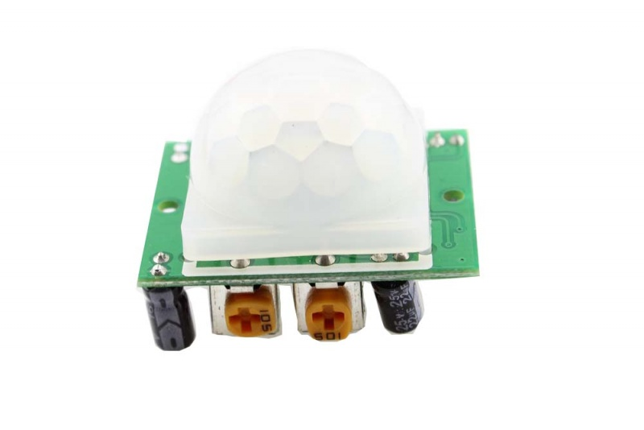
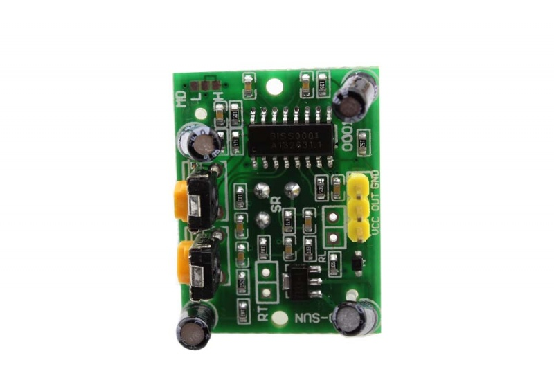
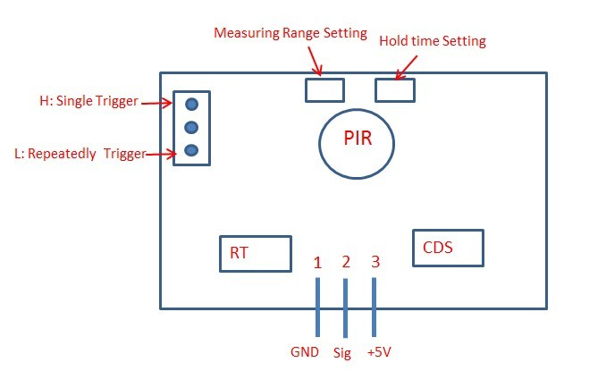

# ER-SOD00101S PIR Motion Detector

This is a highly integrated module popularly used for human-being entry detection, it can simplely and easily to adopt in system. There are two adjustable potentiometer on the module, you can use them to change the trigger sensitivity and the duration of the trigger signal.Besides,The module can also be set as retriggerable or un- retriggerable. When the switch is in the H position, the module is retriggerable and is unretrigerred when the switch is in L position.

## Specification
* Input Voltage: DC 4.5-20V
* Static current: 50uA
* Output signal: 0,3V or 5V (Output high when motion detected)
* Sentry Angle: 110 degree
* Sentry Distance: max 7 m
* Shunt for setting override trigger: H - Yes, L - No

## Interface

