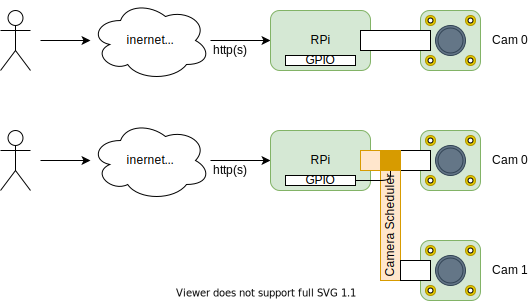
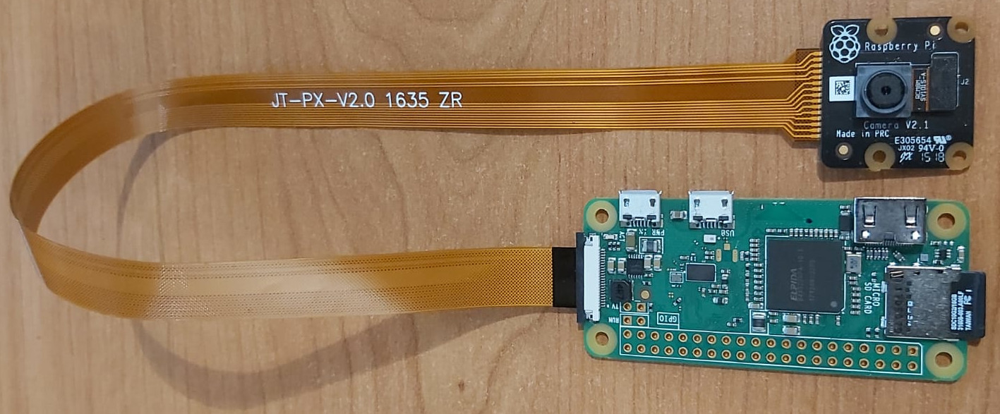

# RPi Camera REST
This is simple REST service daemon, which allows access camera on Raspberry PI devices remotely.



## Hardware
* Supported RPi devices: Raspberry Pi Zero WH, 2, 3, 4.
* Camera modules:
  * Raspberry Pi [Camera Module v2](https://www.raspberrypi.org/products/camera-module-v2/)
  * Raspberry Pi [NoIR Camera v2](https://www.raspberrypi.org/products/pi-noir-camera-v2/)
  * [Waveshare Camera Modules](https://www.waveshare.com/product/raspberry-pi/cameras.htm).

## Install on Raspberry PI
1. Install [Raspberry Pi OS Lite 2021-05-28](https://downloads.raspberrypi.org/raspios_lite_armhf/images/raspios_lite_armhf-2021-05-28/)
2. Enable camera using ``sudo raspi-config``
3. Install software dependencies
   ```
   sudo apt install python-picamera python3-picamera
   sudo apt install python3-pip
   pip3 install Flask 
   pip3 install flask_httpauth
   ```
4. Copy files on Raspberry Pi device into directory ``/opt/camera`` 
5. Edit configuration file ``camera-rest.json``, 
   set http listening port, user credentials. 
6. Install and enable ``camera-rest`` as systemd service.
   ```
   sudo cp camera-rest.service /etc/systemd/system/
   sudo chown root:root /etc/systemd/system/camera-rest.service
   sudo systemctl daemon-reload
   sudo systemctl enable camera-rest
   ```
7. Start | Stop ``camera-rest`` service.
   ```
   sudo systemctl start camera-rest
   sudo systemctl stop camera-rest
   sudo systemctl status camera-rest
   ```

## REST APIs and Endpoints
* [HTTP basic authentication](https://en.wikipedia.org/wiki/Basic_access_authentication) is required.
* Get info about RPi Camera device.  
  __GET__ ``/system/info``  
  ``curl -u client-001:ex4oo http://<ip-address>:<port>/system/info``
* Get current configuration  
  __GET__ ``/system/config``  
  ``curl -u client-001:ex4oo http://<ip-address>:<port>/system/config``
* Set camera capture configuration   
  __POST__ ``/system/config``  
  Supported config parameters  

  |  parameter    | type   | default | description                                   |
  |---------------|--------|---------|-----------------------------------------------|
  | shutter-speed | float  | 0       | float, shutter speed in milliseconds          |
  | format        | string | "jpeg"  | enum, "JPEG", "PNG"                           |
  | resolution    | string | "5M"    | enum, "M03", M1", "M2", "M5", "M8" megapixels |
  | rotation      | int    | 0       | enum, degrees "D0", "D90", "D180", "D270"     |
  | quality       | int    | 85      | int in range 0-100                            |

* Capture single image and download it as attachment.   
  __GET__ ``/system/capture``  
  ``curl -u client-001:ex4oo http://<ip-address>:<port>/system/capture --output snapshot.jpg``  
  

### Hardware Assembly



   
*Enjoy !*
