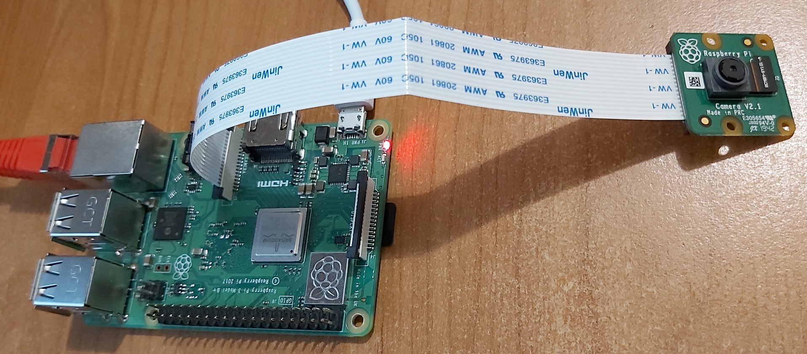
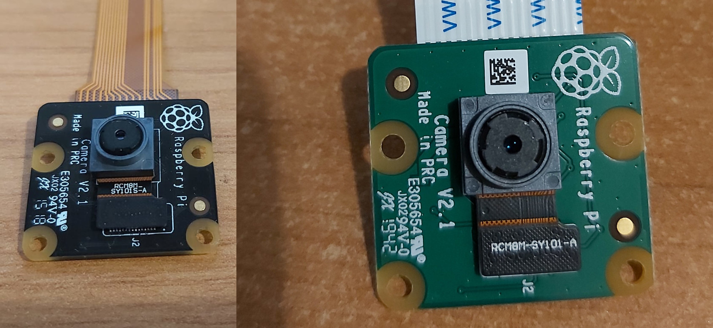

# RPi Camera REST
This is simple REST sercice daemon, which allows access camera on Raspberry PI devices remotely.

## Hardware
* Supported RPi devices: Raspberry Pi 2, 3, 4.
* Raspberry Pi [Camera Module v2](https://www.raspberrypi.org/products/camera-module-v2/)

## Install on Raspberry PI
1. Install [Raspbian Buster Lite 2020-02-13](https://www.raspberrypi.org/downloads/raspbian/)
2. Enable camera using ``raspi-config``
3. Install software dependencies
   ```
   sudo apt install python-picamera python3-picamera
   sudo apt install python3-pip
   pip3 install Flask 
   ```
4. Copy files on Raspberry Pi device into directory ``/opt/camera`` 
5. Edit configuration file ``camera-rest.json``
6. Install and enable ``camera-rest`` as systemd service.
   ```
   sudo cp camera-rest.service /etc/systemd/system/
   sudo chown root:root /etc/systemd/system/camera-rest.service
   sudo systemctl daemon-reload
   sudo systemctl enable camera-rest
   ```
7. Start | Stop ``camera-rest`` service.
   ```
   sudo systemctl start camera-rest
   sudo systemctl stop camera-rest
   sudo systemctl status camera-rest
   ```

## REST APIs
* Get info about RPi Camera device.  
  __GET__ ``/info``
* Capture and download image.   
  __GET__ ``/capture``

### Details



   
*Enjoy !*
   
