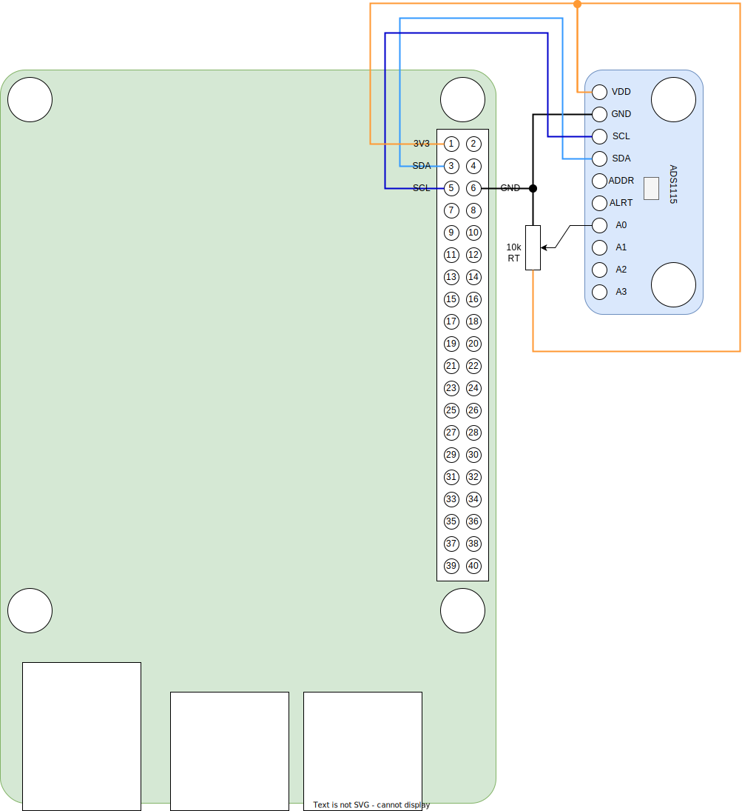

# ADS1115
Low-Power I2C 4-channel, 16-Bit Analog-to-Digital Converter.

* Default address: 0x48
* [datasheet](ADS1115.pdf)
* [interface](../src/main/java/one/microproject/rpi/hardware/gpio/sensors/ADS1115.java)
* [example of use](../src/main/java/one/microproject/rpi/hardware/gpio/sensors/tests/ADS1115Test.java)

* RT is test resistor / potentiometer. Variable output terminal may be connected to any of input (A0, A1, A2, A3) pins.
