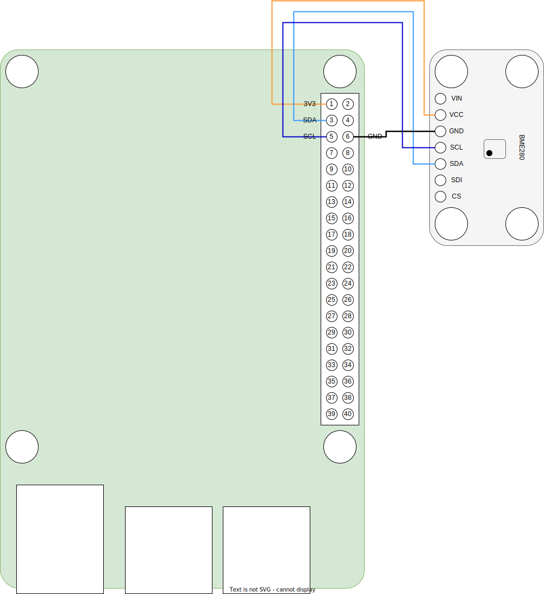

# BME280 
Bosch Digital I2C temperature, relative humidity and pressure sensor.

* Default address: 0x76
* [datasheet](BME280.pdf)
* [interface](../src/main/java/one/microproject/rpi/hardware/gpio/sensors/BME280.java)
* [example of use](../src/main/java/one/microproject/rpi/hardware/gpio/sensors/tests/BME280Test.java)

