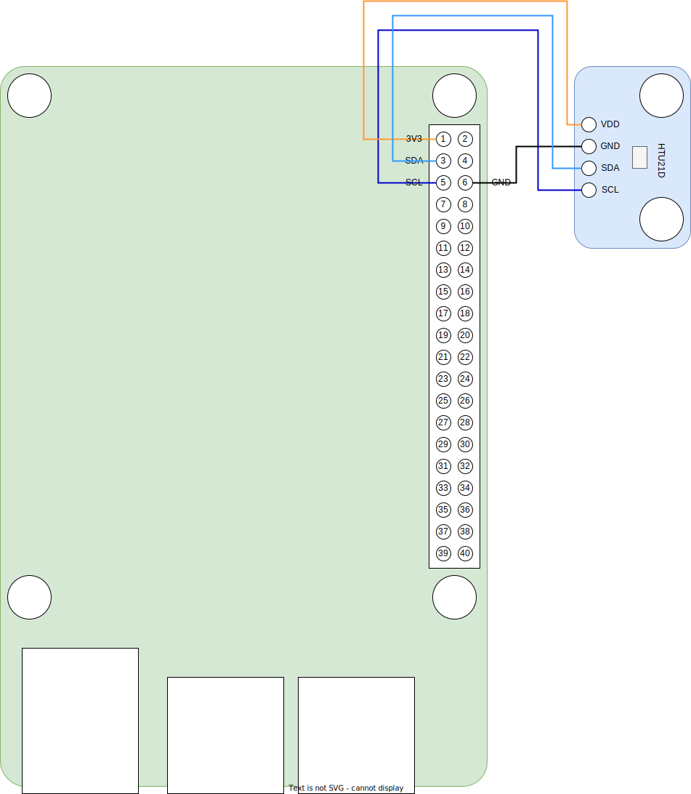

# HTU21D 
Digital I2C temperature and relative humidity sensor.

* Default address: 0x76
* [datasheet](HTU21D.pdf)
* [interface](../src/main/java/one/microproject/rpi/hardware/gpio/sensors/HTU21DF.java)
* [example of use](../src/main/java/one/microproject/rpi/hardware/gpio/sensors/tests/HTU21DTest.java)

