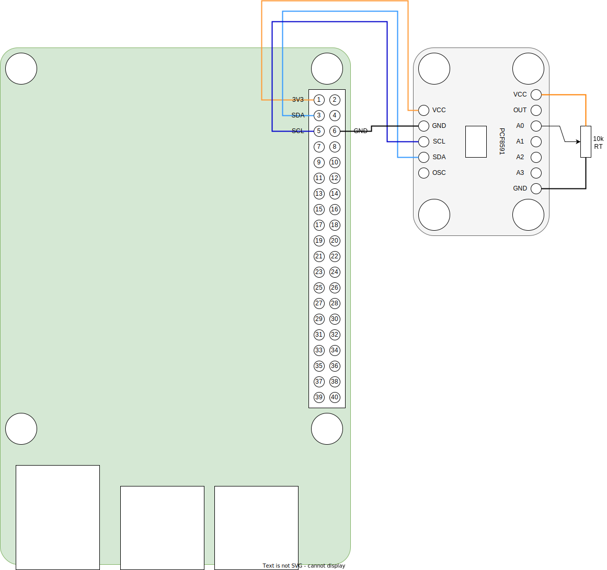

# PCF8591
I2C 4-channel, 8-bit A/D and D/A converter.

* Default address: 0x48
* [datasheet](PCF8591.pdf)
* [interface](../src/main/java/one/microproject/rpi/hardware/gpio/sensors/PCF8591.java)
* [example of use](../src/main/java/one/microproject/rpi/hardware/gpio/sensors/tests/PCF8591Test.java)

* RT is test resistor / potentiometer. Variable output terminal may be connected to any of input (A0, A1, A2, A3) pins.
  Use RT to change input voltage during the test.