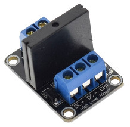
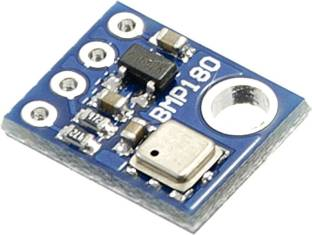
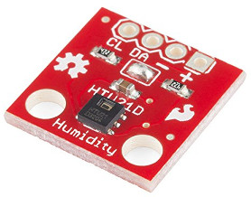

# Hardware BOM
This is detailed HW equipment Bill of Material for RPi Power Controller.
* __Raspberry PI device__ - Raspberry PI 2,3,4, zero.
* __OMRON G3MB-202P__ - Solid State Relay [data sheet](https://www.openhacks.com/uploadsproductos/g3mb-ssr-datasheet.pdf).  
  
  
* __BMP180__ - Bosch I2C Temperature and Atmospheric pressure sensor [adafruit](https://www.adafruit.com/product/1603).  
  
* __HTU21D__ - I2C relative humidity and temperature sensor [adafruit](https://www.adafruit.com/product/1899).  
  
  
## Example Assembly
This assembly uses only two output power ports __(Port 0, Port 1)__ and only one __(Key 0)__.  
