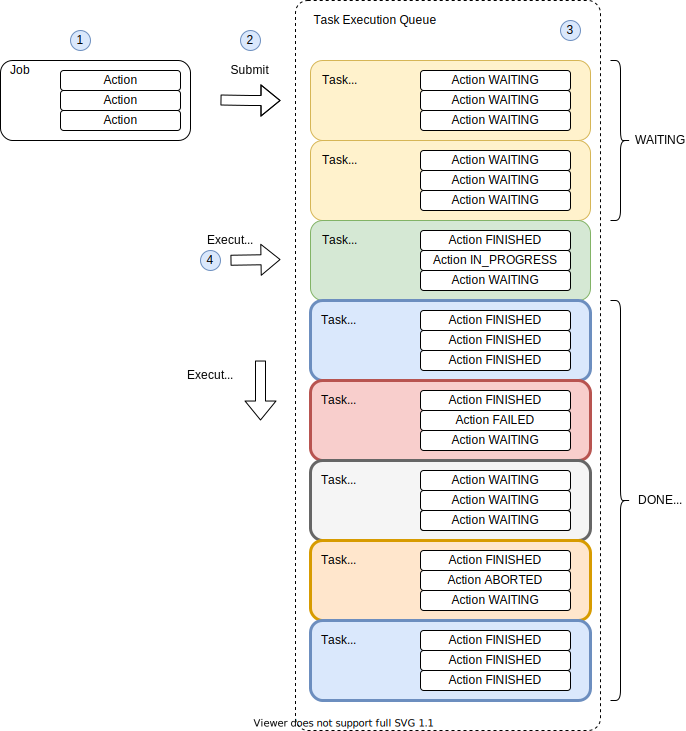
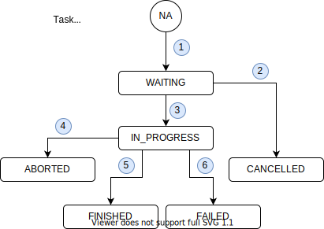

## Jobs, Tasks and Actions

* __job__ - is abstract definition if task, one job consists one or more tasks.
* __action__ - is simple action step executed as part of job.
* __task__ - an instance of job submitted for execution.

### Task Execution
__rpi-powercontroller__ is executing submitted jobs in serial manner and order.
Submitted job is transformed into task with unique task-id and becomes part of job queue execution.
All tasks are executed on single thread. 

* __WAITING__ - Task was created and is waiting for execution in queue. 
* __IN_PROGRESS__ - Task is executed / running. 
* __CANCELLED__ - Task was cancelled before is being executed. 
* __ABORTED__ - Task was interrupted while executing / running. 
* __FINISHED__ - Task finished successfuly.
* __FAILED__ - Task failed during it's execution.

1. Job is submitted for execution, an instance of task is created with unique task-id.
2. Task is cancelled without starting execution phase.
3. Task is started.
4. Running/executed task is cancelled.
5. Task execution finished without exception or error.
6. Task execution finished with error or execption occured.

#### Submit new Task
* submit task by jobId - TBD
* submit parametric task by jobId - TBD/WIP 

#### List Task Queue
TBD

#### Cancel Submitted Task
TBD

#### Kill Them All
* __killAllTasksJobId__ - selected job may be triggered on killAllTasks event. 
  This event stops currently executed task as well as all tasks waiting in 
  the execution queue. Once all tasks are stopped or cancelled, an instance of 
  killAllTasksJobId is executed in same thread.  

#### Default Actions
* __action-port-high__ - turns ON selected port.
* __action-port-low__ - turns OFF selected port.
* __action-wait__ - waits idle for given time period.

#### Custom Actions
TBD/WIP
