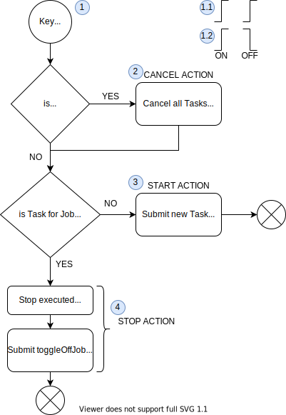

## Key Event Processing

1. Key Event is triggered.  
   1.1 Triggered only by raising edge.
   1.2 Triggered by leading anf falling edge.
2. Instances of the trigger job WAITING in the queue are cancelled.
3. An instance of job is submitted for execution.
4. Stop task is executed, Submit cleanup task.    
   
