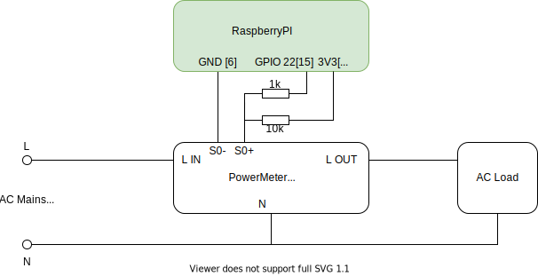

# RPi Power Meter
This project describes how to build AC power meter. 


Detailed [hardware bill of material](docs/hardware-bom.md).

## Install on Raspberry PI
1. Install [Raspberry Pi OS Lite 2021-05-28](https://downloads.raspberrypi.org/raspios_lite_armhf/images/raspios_lite_armhf-2021-11-08/)
2. Copy files on Raspberry Pi device into directory ``/opt/powermeter``
5. Edit configuration file ``powermeter.json``.
6. Install and enable ``powermeter`` as systemd service.
   ```
   sudo cp powermeter.service /etc/systemd/system/
   sudo chown root:root /etc/systemd/system/powermeter.service
   sudo systemctl daemon-reload
   sudo systemctl enable powermeter
   ```
7. Start | Stop ``powermeter`` service.
   ```
   sudo systemctl start powermeter
   sudo systemctl stop powermeter
   sudo systemctl status powermeter
   ```

### References
* __DIN 43864__ - Electricity meters; current interface for transmitting pulses from a pulsing meter to a tariff metering device
* [Reading PNP pulse output directly to the GPIO](https://forums.raspberrypi.com/viewtopic.php?t=284916)
