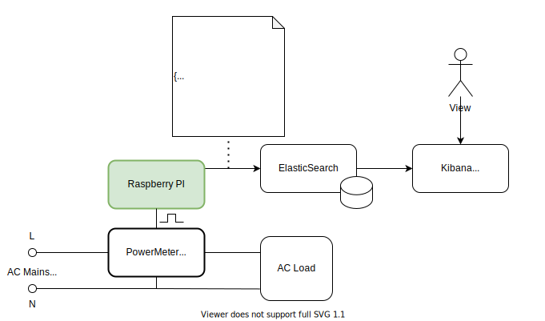

# RPi Power Meter
This project describes how to build single phase AC power meter and 
send meter data to central database (ElasticSearch). Power meter used in this project is
digital __DDS-1Y-18L__ single phase DIN rail type equipped with __DIN 43864__ compatible pulse interface.




## Hardware Architecture
Detailed [hardware bill of material](docs/hardware-bom.md). Raspberry Pi is connected to 
digital power meter output (S0- and S0+) via GPIO pins. Digital power meter produces one 
pulse per power consumption unit (usually one pulse per 1Wh, ot 1000 pulses per 1kWh). Pulse 
from digital power meter is detected by GPIO input pin [15] and triggers data calculation and 
upload to elasticsearch. For details see [powermeter.py](powermeter.py) implementation.


## Install on Raspberry PI
1. Install [Raspberry Pi OS Lite 2021-05-28](https://downloads.raspberrypi.org/raspios_lite_armhf/images/raspios_lite_armhf-2021-11-08/)
2. Copy files on Raspberry Pi device into directory ``/opt/powermeter``
5. Edit configuration file ``powermeter.json``.
6. Install and enable ``powermeter`` as systemd service.
   ```
   sudo cp powermeter.service /etc/systemd/system/
   sudo chown root:root /etc/systemd/system/powermeter.service
   sudo systemctl daemon-reload
   sudo systemctl enable powermeter
   ```
7. Start | Stop ``powermeter`` service.
   ```
   sudo systemctl start powermeter
   sudo systemctl stop powermeter
   sudo systemctl status powermeter
   ```

### Configuration
Check [this](powermeter.json) configuration example.

| parameter          | description |
|--------------------|-------------|
| device-id          | Unique device id for better power meter indentification. |
| pulse-value        | Value of one meter pulse in kWh. |
| voltage-ac         | Standard AC voltage. |
| cost-kwh           | Cost of one kWh. |
| co2g-per-kwh       | Average CO2 grams produced per kWh. |
| max-power-kw       | Max power daw of connected load in kW. Used to filter/ignore false meter pulses or interference. |
| meter-pin          | GPIO pin number connected to powermeter |
| data-store/elastic | Hostname and port of ElasticSearch Server. Example: "192.168.44.101:9200" |
| data-store/index   | Index name in ElasticSearch used to store power meter data. |

## ElasticSearch setup
1. Create index to store powermeter data. How to start [Elasticsearch in docker](https://github.com/jveverka/guildelines-and-procedures/tree/master/docker/elastic-monitoring-stack).
   ```
   curl --request PUT \
     --url http://<elastic-host>:9200/power-meter \
     --header 'Content-Type: application/json' \
     --data '{
     "mappings": {
       "properties": {
         "timestamp": {
           "type": "date",
           "format": "epoch_millis"
         }
       }
     }
   }'
   ```
2. Check data written into ``power-meter`` index.
   ```
   curl --request GET \
     --url http://<elastic-host>:9200/power-meter/_search
   ```
3. Use Kibana to check data in ``power-meter`` index. Dashboard example in Kibana:
   

### References
* __DIN 43864__ - Electricity meters; current interface for transmitting pulses from a pulsing meter to a tariff metering device
* [Reading PNP pulse output directly to the GPIO](https://forums.raspberrypi.com/viewtopic.php?t=284916)
* [Electricity production emissions by country](https://www.nowtricity.com/)