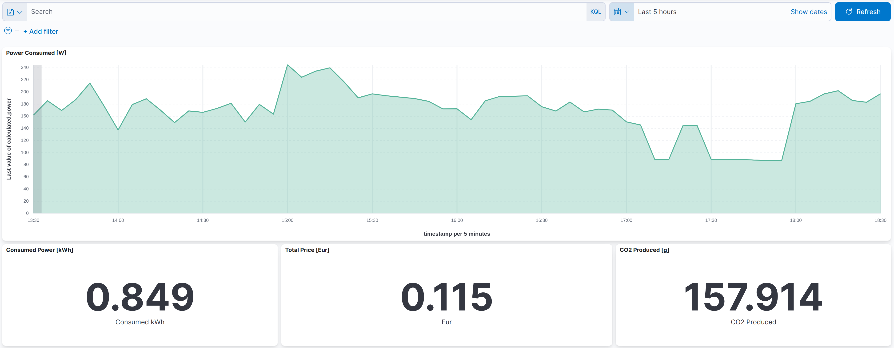

# Hardware BOM
This is detailed HW equipment Bill of Material for RPi Power Meter.
 
* __Raspberry PI device__ - Raspberry PI 2,3,4, Zero W, Zero 2 W.
* __Power Meter DDS-1Y-18L__ - digital single phase with __DIN 43864__ pulse interface.
  Some examples of compatible digital meters.
  * [LE-01d MID](https://www.firn.sk/le-01d-mid-p2288)
  * [WZE-1](https://www.firn.sk/wze-1-p9977)
* __Resistors__ 
  * 1k
  * 10k
* __Power Supply__ - 240V ~AC , 5V/1A power supply. Old recycled USB charger is just fine.

