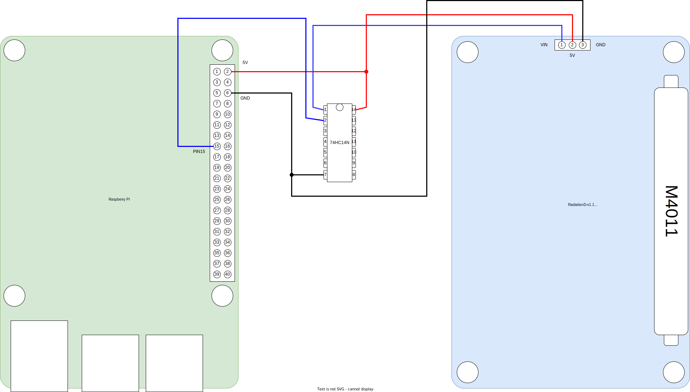

# RPi Radiation Monitor
This project describes how to build simple radiation meter and connect it to internet.



### REST API
* Get system info
  ```
  curl -u client-001:Jah7thei --location --request GET 'http://<hostname>:<port>/api/v1/system/info'
  ```
* Get radiation measurements
  ```
  curl -u client-001:Jah7thei --location --request GET 'http://<hostname>:<port>/api/v1/system/measurements'
  ``` 

### Prototype
