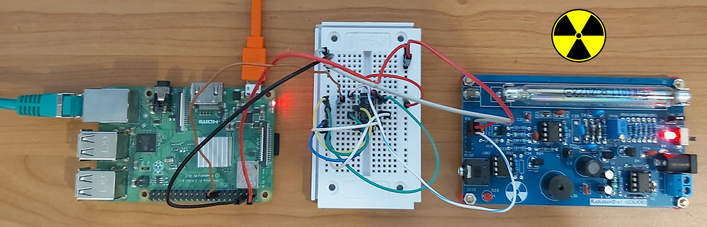

# RPi Radiation Monitor
This project describes how to build simple radiation meter and connect it to internet.
[RadiationD-1.1(CAJOE) board](https://github.com/SensorsIot/Geiger-Counter-RadiationD-v1.1-CAJOE-)
with [M4011 Geiger Tube](https://github.com/SensorsIot/Geiger-Counter-RadiationD-v1.1-CAJOE-/blob/master/M4011%20Geiger%20Tube%20Specification.pdf)
is used as radiation sensor.


## Hardware components
1. Raspberry PI 3,4,zero
2. [74HC14N](https://datasheet.octopart.com/74HC14N-Philips-datasheet-7274161.pdf) - Hex Schmitt Inverter, transforming slowly changing input signals into sharply
   defined, jitter-free output signals.
3. [RadiationD-1.1(CAJOE) board](https://github.com/SensorsIot/Geiger-Counter-RadiationD-v1.1-CAJOE-)

## Install on Raspberry PI
1. Install [Raspberry Pi OS Lite](https://downloads.raspberrypi.org/raspios_lite_armhf/images/raspios_lite_armhf-2022-04-07/2022-04-04-raspios-bullseye-armhf-lite.img.xz)
2. Copy files on Raspberry Pi device into directory ``/opt/rpi-radiation-monitor``
5. Edit configuration file [``rpi-radiation-monitor.json``](rpi-radiation-monitor.json).
6. Install and enable ``rpi-radiation-monitor`` as systemd service.
   ```
   sudo cp rpi-radiation-monitor.service /etc/systemd/system/
   sudo chown root:root /etc/systemd/system/rpi-radiation-monitor.service
   sudo systemctl daemon-reload
   sudo systemctl enable rpi-radiation-monitor
   ```
7. Start | Stop ``rpi-radiation-monitor`` service.
   ```
   sudo systemctl start rpi-radiation-monitor
   sudo systemctl stop rpi-radiation-monitor
   sudo systemctl status rpi-radiation-monitor
   ```

### REST API
* Security [HTTP Basic access authentication](https://en.wikipedia.org/wiki/Basic_access_authentication) 
  is used for all REST endpoints, credentials are set in [config](rpi-radiation-monitor.json) file. 
* GET radiation measurements:
  ```shell
  curl -u client-001:Jah7thei --location --request GET 'http://<hostname>:<port>/api/v1/system/measurements'
  ``` 
  Example response. cpm = count per last minute.
  ```json
  {
    "radiation": {
        "value": 0.1390728476821192,
        "unit": "uSv/h"
    },
    "counter": {
        "cpm": 21,
        "total": 2463
    },
    "timestamp": 1653722329.4236865,
    "uptime": 6450.739503145218
  }
  ```
* GET system info:
  ```shell
  curl -u client-001:Jah7thei --location --request GET 'http://<hostname>:<port>/api/v1/system/info'
  ```
  ```json
  {
    "id": "rpi-radiation-monitor-001",
    "type": "rpi-radiation-monitor",
    "version": "1.0.0",
    "name": "RPI Radiation Monitor",
    "timestamp": 1653722673,
    "uptime": 6793
  }
  ```

### Prototype


### Schema

