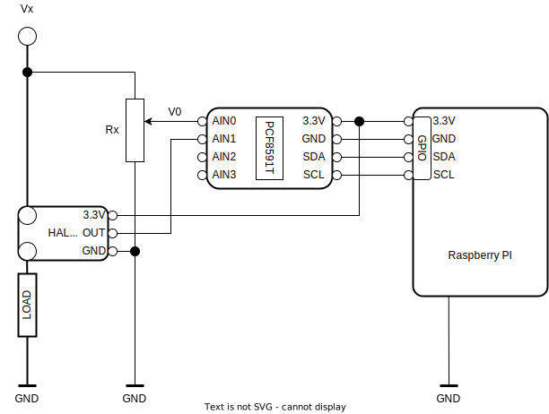
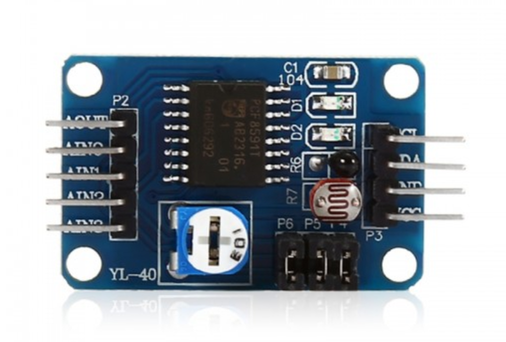

# RPI Voltage and Current sensors
This projects shows how to use some of AD converters and current sensors with raspberry pi.


## General setup
1. Enable I2C bus.
   ``` 
   sudo raspi-config
   ```
2. Install gpio and i2c packages.   
   ```
   sudo apt-get install python3-smbus python3-dev i2c-tools
   sudo i2cdetect -y 1
   ```
   
### PCF8591T 4CH 8-Bit A/D Converter
* [Datasheet](docs/PCF8591.pdf) 
* [Sample code](pcf8591t.py)



### ADS1115 4CH 16-Bit A/D Converter
* [Datasheet](docs/ads1115.pdf)
* [Sample Code](https://github.com/adafruit/Adafruit_Python_ADS1x15)
