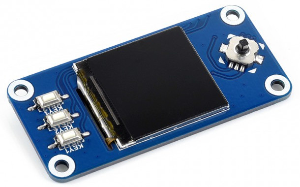
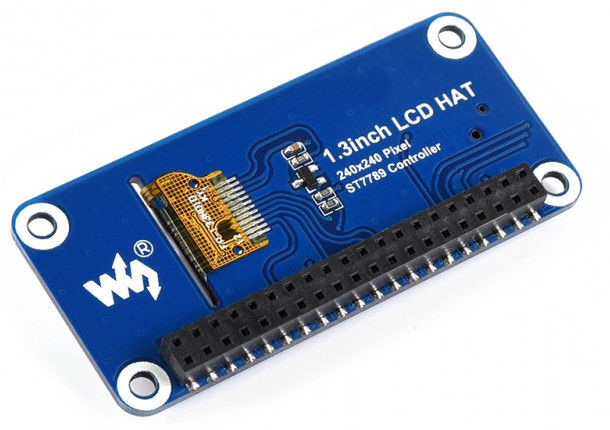
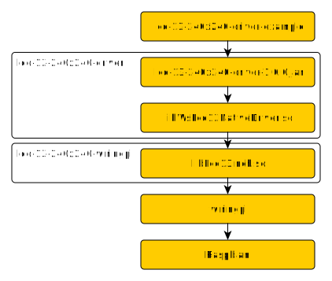

# LCD drivers for raspberry PI
This project contains java JNI driver implementation for 1.3" Inch color 240x240 display hat for raspberry pi.
Original product page is [here](https://www.waveshare.com/1.3inch-lcd-hat.htm) 
Technical details are [here](https://www.waveshare.com/wiki/1.3inch_LCD_HAT).

## Project content
* [lcd-13-240x240-wiringpi](lcd-13-240x240-wiringpi/README.md) - native driver implementation
* [lcd-13-240x240-driver](lcd-13-240x240-driver/README.md) - JNI wrapper of native driver implementation
* [lcd-13-240x240-driver-example](lcd-13-240x240-driver-example/README.md) - example of use for JNI wrapper

## Hardware requirements
- Raspberry PI 2, 3, zero
- waveshare 240x240, 1.3" IPS LCD display HAT installed



## Project architecture


## Build and Run
This code requires hardware and native libraries to run. Whole project needs to be compiled and run on 
Raspberry PI [raspbian](https://www.raspberrypi.org/downloads/raspbian/) lite distribution (tested with raspbian lite 'stretch').

### Raspberry PI setup
This is description of initial setup of raspberry pi device.
* this setup is tested with [raspbian](https://www.raspberrypi.org/downloads/raspbian/) Stretch Lite (2018-11-13)
* using ``raspi-config`` enable I2C and SPI (restart required)
* make sure that ``/etc/modules`` contains 
  ```
  i2c-dev
  spi-dev
  ```
* install java ``apt-get install openjdk-8-jdk-headless``
* download and install [gradle](https://services.gradle.org/distributions/gradle-5.0-bin.zip) 
* make sure wiringpi is installed by running ``gpio -v``
* install git ``apt-get install git``

### Project build
This project must be compiled in Raspberry Pi, because is native code depends on [wiringpi](http://wiringpi.com/) library. 
Java components from this project may be compiled on x86 platform.
To build complete project on Raspberry Pi:
```
gradle clean build
```
To build complete project and install java driver artifact into local maven repository:
```
gradle clean build install
```

### Run the demo
To run demo on Raspberry Pi, build project and:
```
cd lcd-13-240x240-driver-example/build/application/
./start-demo.sh
```
